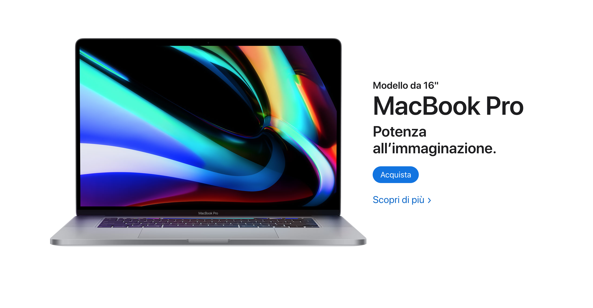
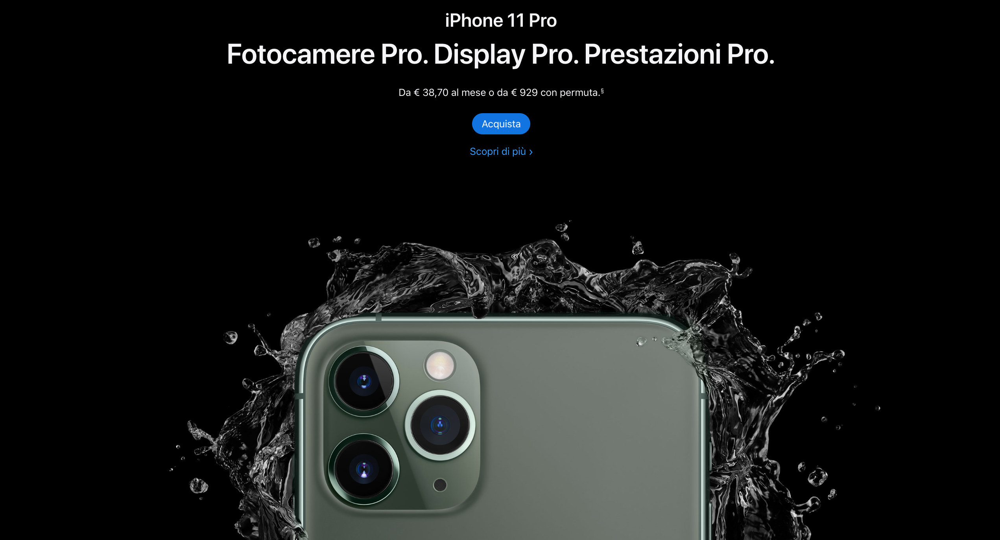
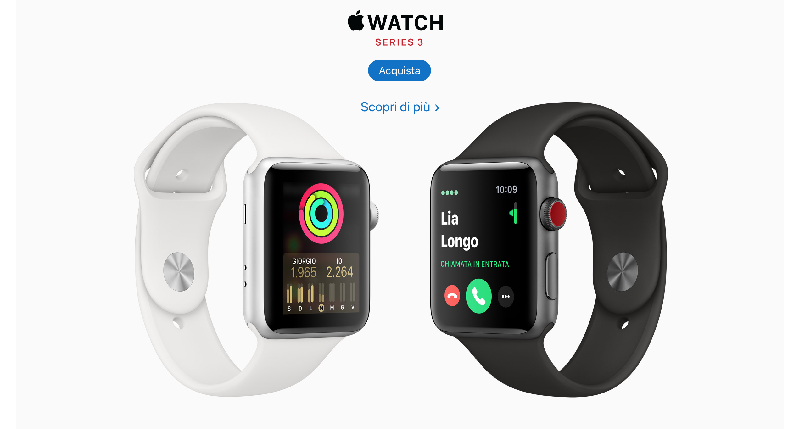

# E-commerce Apple Products


## Main Page whit Navbar


<br>
<br>

## Macbook pro section




<br>
<br>

## Iphone section




<br>
<br>

## Apple Watch section




<br>
<br>


## Apple Music section


<br>
<br>

Additional description about the project and its features.


# How to clone
Enter the following into your terminal ``` git@github.com:TommyM0ntana/apple_clone.git```

# Technologies used
- CSS3
- HTML5
- [Font Awesome Icons](https://fontawesome.com/start)
- [Stickler](https://stickler-ci.com)
- [Githack](https://raw.githack.com/)

## Live Demo

[The App](https://raw.githack.com/TommyM0ntana/E-commerce-Apple-products/master/index.html)

## 🤝 Contributing

Contributions, issues and feature requests are welcome!


## Show your support

Give a ⭐️ if you like this project!

## Acknowledgments

- Hat tip to anyone whose code was used.

## 📝 License

This project is [MIT](https://opensource.org/licenses/MIT) licensed.
